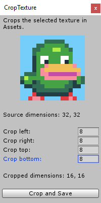
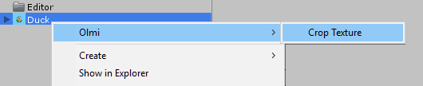

# CropTexture

 

## What is it

I wrote this small tool so that I could crop images right inside Unity Editor.

It should be placed somewhere in a project inside an Editor folder.

Then it can be launched in Project folder in the right click popup menu.

## Features

- Texture preview
    - Shows the cropped texture in the viewport
    - Aspect ratio is forced to the square preview

- Display source resolution
- Display target cropped resolution

- File saving in PNG format

## Other Information

Currently it is intended only for single images, there's no batch processing.

Developed on Unity 2018.4.12f1.
